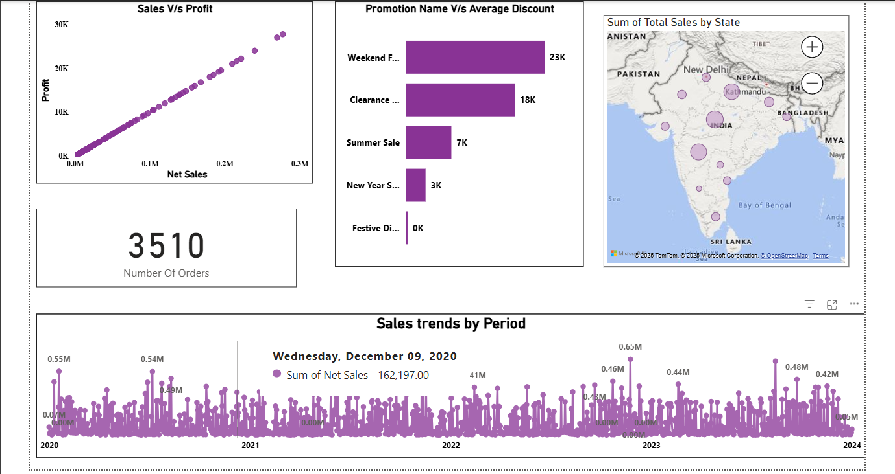
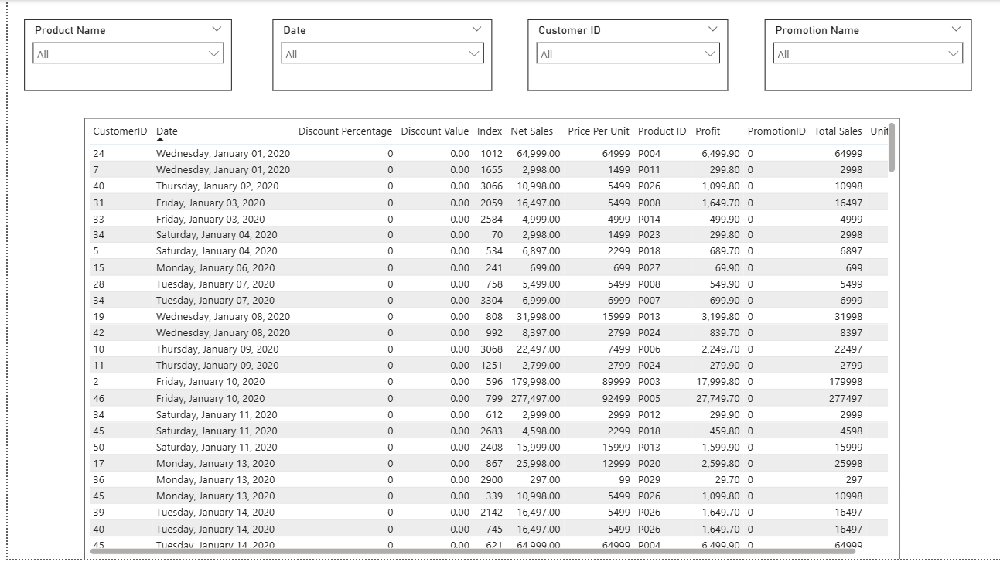
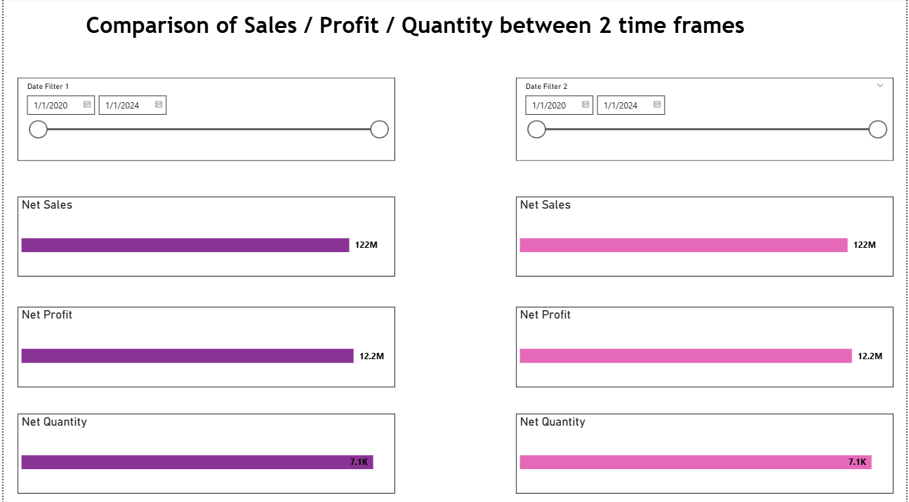
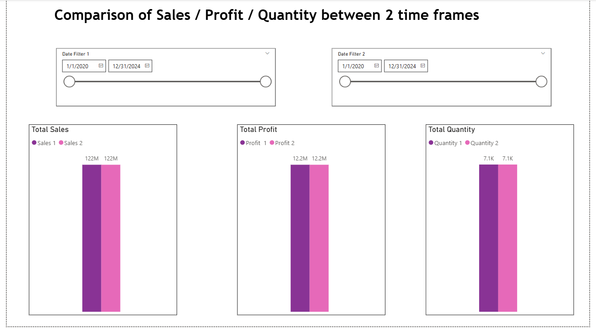
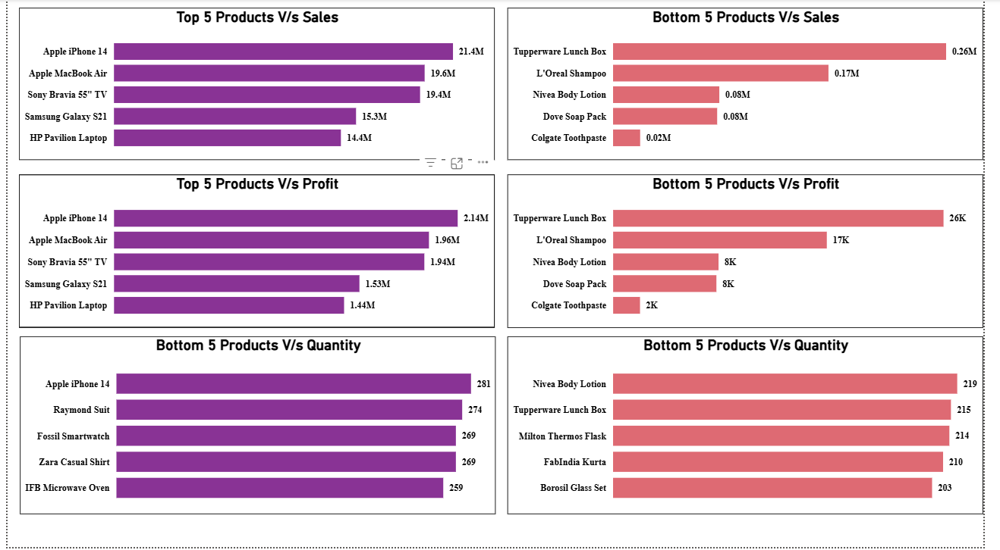

# Sales Data Analysis

## Components and Technology Used
- **Data Extraction:** SQL, Power Query (M)
- **Transformation:** Star Schema, Incremental Refresh
- **Analysis:** DAX, Python Scripts
- **Visualization:** Custom Theme, Drill-throughs
- **Deployment:** Power BI Service, PDF Exports

## Situation (S)
- Faced with disparate sales data sources (SQL, Excel, CRM) with 1M+ unstructured records
- Manual reporting processes taking 15+ hours weekly
- No clear visibility into inventory optimization opportunities

## Task (T)
### Objective:
Develop an automated Power BI solution to:
- Provide real-time sales performance tracking
- Identify customer segmentation opportunities
- Optimize inventory management through forecasting

### Action (A)
- **Implementation:**
  - ETL Pipeline: Built Power Query scripts to clean/transform data (handled 5% missing values)
  - Data Model: Implemented star schema with optimized relationships for DAX performance
  - Advanced Analytics: Developed ARIMA forecast model (92% accuracy)
  - Created dynamic RFM segmentation (DAX measures)
- **Visualization:**
  - Designed interactive dashboards with:
    - Drill-through product analysis
    - Geospatial sales mapping
    - Inventory risk alerts

## Result (R)
- Business Impact:
  - 30% faster decisions through automated KPI tracking
  - 25% reduction in excess inventory costs
  - 15% revenue increase from targeted promotions
  - 40% time savings in monthly reporting

## Visuals

### Sales Performance Chart

### Data Model Diagram

### Additional Visuals

